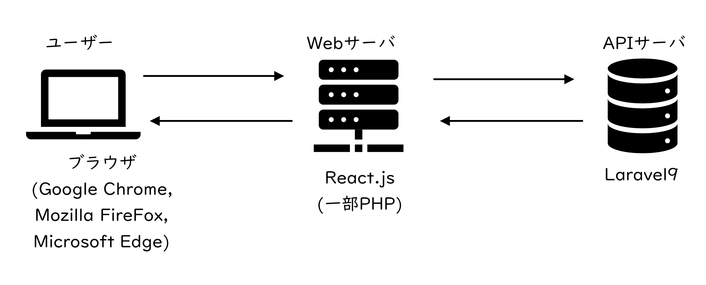
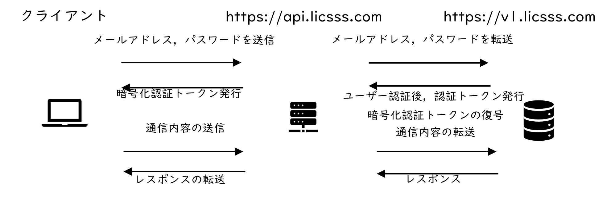

# LiCSSsにようこそ

## LiCSSsについて

LiCSSsとは日常生活で必要なツールを基本無料で提供し，ユーザーの日常生活の利便性向上を目的とするものであり，公式サイトは[https://licsss.com](https://licsss.com)である。運営は一人で行うことを基本とし，外注は行わない。収益化後には外注することも視野に入れ，より機能の拡充を行うようにする。

また，昨今様々なサービスが提供されており，目的に応じてサービスやアカウントを使い分ける必要がある。しかし，使い分けることはユーザーにとって負担であるため，LiCSSsアカウント1つでできる限り多くのサービスが使えるようにすることが最終的な目的となる。

### LiCSSsの由来

LiCSSsのもとは学校図書館向けの図書管理システムであるLiCSSである。LiCSSはLibrary Controlled System for Schoolの略であり，音もよいため採用した。また，最後のsは複数形のsであり，学校図書館での図書管理の利便性が高まるようにと制作したLiCSSの理念を受け継いだシステムを複数提供することを願って複数形のsにした。

### LiCSSsのカラー

LiCSSsのイメージカラーはgrass green(rgb:(55,173,10)　Hex:#37ad0a)である。自然を連想させる色というコンセプトをもとにイメージカラーの選定を行った。まず，緑系の色は森林を連想させる色であり，人々に落ち着きをもたらす色だと考えられる。昨今，インターネットの普及により様々な問題が発生している。その状況を鑑み，少しでも落ち着いてインターネットを利用できればという願いが含まれている。
次にアクセントカラーはイメージカラーの補色となるピンク系(rgb:(237,90,220)　Hex:#ed5adc)とした。フォントカラーについては真っ黒ではなく，少し赤緑青それぞれが入っている色(rgb:(46,46,46)　Hex:#2e2e2e)とした。

最後にページの背景など大多数を占める色については少し青が入った色(rgb:(237,245,247)　Hex:#edf5f7)とした。青は海を連想させる色であり，青にも緑と同じで人を落ち着かせる色だと考えられる。

### 利用料について

基本的に利用料は徴収せずに全機能が利用できるように設定する。

### 収益化について

ユーザーが増えた場合，一部を有料化することを検討するが基本的には無料で行う。しばらくは収益化を目標とせず，ユーザーを増やすことを目的とする。

#### 寄付について

本格的な収益化を行う前にWikipediaのように寄付を募るようにし，寄付でWebサーバ等の必要経費を賄えるようにまず行う。寄付がある程度増えてから本格的に収益化を行う。

寄付についてはStripeを用いてクレジットカードでの決済とする。金額は100円から任意の金額で行えるように設定する。

#### 広告について

収益化を行うにあたってはまずGoogle Adsの広告を最低限の表示とする。それと同時に一般企業対象の広告掲載募集を行う。広告費用については適用時に検討を行う。また，アカウントの種類に広告を表示しない有料プランを設定し，ユーザーからの収益化も行う。ただし，広告の表現は最低限にし，広告の有無によって操作性が大きく損なわれないようにする。

## サービスの概要

LiCSSsが提供するサービスは日常生活をより豊かにするものを基本とし，過剰な娯楽等にはならないように留意し，提供サービスの選定を行う。

### 構想中のサービス

サービス提供開始前の現(2022/02/21)時点で構想しているサービスは以下の通りである。なお，これらはすべて実現することを目的とせず，その時に応じて柔軟にサービスの選定，提供を行うこととする。
1.	ユーザー認証システム
2.	ユーザーアカウントシステム
3.	ユーザープロフィールシステム
4.	ファイル管理システム
5.	チャットシステム
6.	レシピ保存システム
7.	家計簿システム
8.	図書管理システム
9.	グループウェアシステム
10.	店舗利用者管理システム
11.	POSシステム
12.	オーダーシステム
13.	ホテル予約システム
14.	学校教育システム
15.	電子チケット販売・発行システム
16.	病院予約システム
17.	処方箋予約システム
18.	おくすり手帳システム

#### 実現が必須となるサービス

LiCSSsのサービス提供において必須のシステムは4つある。まず，1.ユーザー認証システムである。ユーザー認証システムはLiCSSsのサービスで必要不可欠な機能である。次に2.ユーザーアカウントシステムである。認証情報の変更などアカウントに関する設定を行うために必要不可欠である。また，4.ファイル管理システムも必要である。様々なシステムを実現するためにはファイルの管理も必要であり，ファイルの管理を一元化することが目的である。最後に5.チャットシステムである。所謂SNSのリアルタイムチャットを実現することが最終的な目的であるが，当面は時差を許容とする。さらにLiCSSsのサービスに関する連絡は基本的にメールではなくチャットシステムを用いる。ただし，重要な事項についてはチャットシステムとメールの両方を用いることとする。

### 技術選定について

LiCSSsはまずWebアプリケーションとして提供を行う。ある程度利用者が増えた場合，ハイブリッドアプリの提供について検討を行う。

#### 使用言語・フレームワーク

フロントエンドにはReact.jsを利用する。ただし，ログインページはログイン情報をサーバサイドでセッションを管理するため，phpを用いることとする。

バックエンドにはPHP8系及びLaravel 9系を用いる。

#### サーバ構成

サーバの構成はFigure 1の通りとする。WebサーバとAPIサーバはドメインを分けて行う。またセキュリティを高めるため，APIサーバのドメインやエンドポイントは公開しない。API通信についてはWebサーバを経由して行う。

Figure 1 サーバ構成

#### レンタルサーバの選定

利用するレンタルサーバについては既に契約をしているコアサーバのv1を用いる。ただし，利用ユーザーがある程度増えた場合，v2に移行を行う。これはv1よりもv2のほうが高いセキュリティと考えられるためである。また，ユーザーの利用が多くなりサーバの処理が追い付かなくなった場合，サーバをサービスごとに分割することやより高スペックなサーバに移行することを検討する。

チャットシステムについてはリアルタイムチャットにすることを最終的な目標であるため，利用ユーザーが増えたらVPSに移行する。

#### ドメインについて

公式サイトは[licsss.com](https://licsss.com)とし，その他のサービスのドメインについてはサブドメインで対応する。ただし，サブドメインは基本的に1階層とし，〇〇.××.licsss.comのようにはしない。(APIサーバは除く)

## APIサーバについて

APIサーバのドメインについては[https://v1.api.licsss.com](https://v1.api.licsss.com)とする。ただし，セキュリティのためにこのドメインは公開しない。

クライアントがAPI通信を行う場合，認証サーバでユーザー認証を行い，暗号化をした署名付きの認証トークン(暗号化認証トークン)を受け取る。暗号化認証トークンをエンドポイントなどの情報と共にヘッダに付与し，[https://api.licsss.com](https://api.licsss.com)(公開可)に送信する。[https://api.licsss.com](https://api.licsss.com)はリクエストヘッダをもとに認証コードを復号し，[https://v1.api.licsss.com](https://v1.api.licsss.com)に送信する(Figure 2)。

Figure 2 APIサーバ

## 各サービスの詳細

### ユーザー認証システム
#### システムURL
- API : [https://v1.api.licsss.com/auth](https://v1.api.licsss.com/auth)
- APP : [https://auth.licsss.com](https://auth.licsss.com)

#### 機能一覧
|エンドポイント|メソッド|機能名|機能詳細|
|-|-|-|-|
|/|POST|認証|メールアドレス/電話番号，パスワードでユーザー認証を行う|
|/email|POST|メール認証|登録メールアドレスの認証を行う|
|/refresh|POST|リフレッシュ|アクセストークンのリフレッシュを行う|
|/reset|POST|パスワード忘れ|パスワードリセットのURLを送信する|
|/reset/{id}|PUT|パスワードリセット|パスワードのリセットを行う|

#### 用語定義
|用語|定義|
|-|-|
|メールアドレス|一般的なメールアドレス形式|
|電話番号|携帯電話番号,xxx-xxxx-xxxx|
|パスワード|半角英小文字大文字数字をそれぞれ1つを含み，12文字から20文字の文字列|

#### バージョン情報
##### API
|リリース日|バージョン|説明|
|-|-|-|
|2022.03.07|1.0.0|初回公開|
##### APP
|リリース日|バージョン|説明|
|-|-|-|
|2022.03.07|1.0.0|初回公開|

### ユーザーアカウントシステム

認証情報の変更など必要不可欠である。また，LiCSSs独自の仮想アカウントについての設定も行う。

仮想アカウントとは1つのアカウントで複数のアカウントを利用できるようにするものである。目的に応じたアカウントを作成し，使い分けるユーザーが一定数いるが，毎度ログインすることはユーザーにとって負担となるためである。この機能によりプライベートとビジネス，趣味等を簡単に使い分けることが可能になると考えられる。

#### システムURL
- API : [https://v1.api.licsss.com/user](https://v1.api.licsss.com/user)
- APP : [https://home.licsss.com](https://home.licsss.com)

#### 機能一覧
|エンドポイント|メソッド|機能名|機能詳細|
|-|-|-|-|
|/|GET|アカウント情報取得|アカウント情報の取得を行う|

#### 用語定義
|用語|定義|
|-|-|

#### バージョン情報
##### API
|リリース日|バージョン|説明|
|-|-|-|
|2022.03.07|1.0.0|初回公開|
##### APP
|リリース日|バージョン|説明|
|-|-|-|
|2022.03.07|1.0.0|初回公開|

### ユーザープロフィールシステム

個人情報以外は公開される。個人情報は基本的に利用しないため，開発は後回しとする。利用ユーザーが増え，サービスを拡充する際に必要となる場合に提供する機能。

#### システムURL
- API : [https://v1.api.licsss.com/profile](https://v1.api.licsss.com/profile)
- APP : [https://home.licsss.com](https://home.licsss.com)

#### 機能一覧
|エンドポイント|メソッド|機能名|機能詳細|
|-|-|-|-|

#### 用語定義
|用語|定義|
|-|-|

#### バージョン情報
##### API
|リリース日|バージョン|説明|
|-|-|-|
|2022.03.07|1.0.0|初回公開|
##### APP
|リリース日|バージョン|説明|
|-|-|-|
|2022.03.07|1.0.0|初回公開|

### ファイル管理システム

#### システムURL
- API : [https://v1.api.licsss.com/file](https://v1.api.licsss.com/file)
- APP : [https://home.licsss.com](https://home.licsss.com)
- VIEW : [https://file.licsss.com](https://file.licsss.com)
- DOWNLOAD : [https://download.licsss.com](https://donwload.licsss.com)

#### 機能一覧
|エンドポイント|メソッド|機能名|機能詳細|
|-|-|-|-|

#### 用語定義
|用語|定義|
|-|-|

#### バージョン情報
##### API
|リリース日|バージョン|説明|
|-|-|-|
|2022.03.07|1.0.0|初回公開|
##### APP
|リリース日|バージョン|説明|
|-|-|-|
|2022.03.07|1.0.0|初回公開|

### チャットシステム

はじめはシステムからのお知らせ配信が目的である。仮想アカウントごとに表示，まとめて表示など選択可能とする。チャットルームは個人と複数，グループの3種類とする。送信先の個人を複数設定し，まとめて送信することも可能とする。

#### システムURL
- API : [https://v1.api.licsss.com/chat](https://v1.api.licsss.com/chat)
- APP : [https://chat.licsss.com](https://chat.licsss.com)

#### 機能一覧
|エンドポイント|メソッド|機能名|機能詳細|
|-|-|-|-|

#### 用語定義
|用語|定義|
|-|-|

#### バージョン情報
##### API
|リリース日|バージョン|説明|
|-|-|-|
|2022.03.07|1.0.0|初回公開|
##### APP
|リリース日|バージョン|説明|
|-|-|-|

### レシピシステム

レシピ共有システムは多いが非公開の個人向けのレシピ保存システムがないため，政策をする。公開非公開の設定を可能とする。また，材料の単価を登録し，原価計算も可能とする。さらに材料を任意の量に変更できるように自動で計算を行う。

#### システムURL
- API : [https://v1.api.licsss.com/recipe](https://v1.api.licsss.com/recipe)
- APP : [https://recipe.licsss.com](https://recipe.licsss.com)

#### 機能一覧
|エンドポイント|メソッド|機能名|機能詳細|
|-|-|-|-|

#### 用語定義
|用語|定義|
|-|-|

#### バージョン情報
##### API
|リリース日|バージョン|説明|
|-|-|-|
|2022.03.07|1.0.0|初回公開|
##### APP
|リリース日|バージョン|説明|
|-|-|-|

